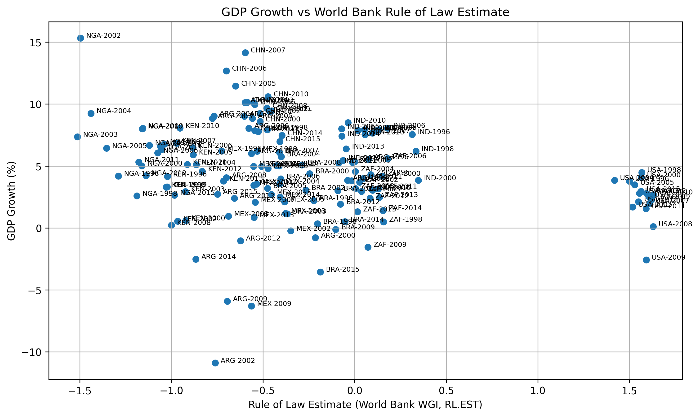
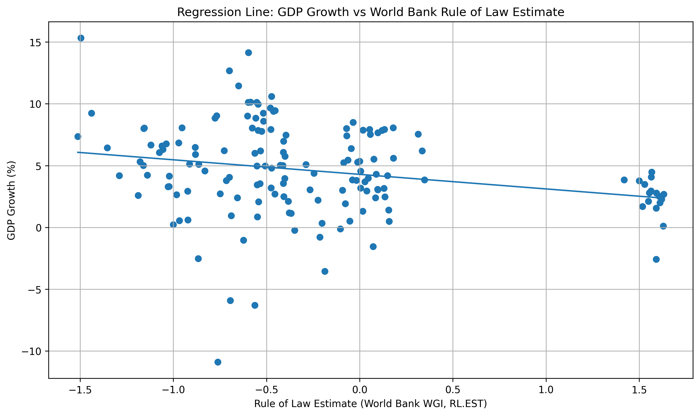
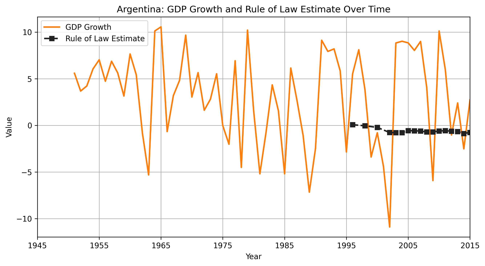
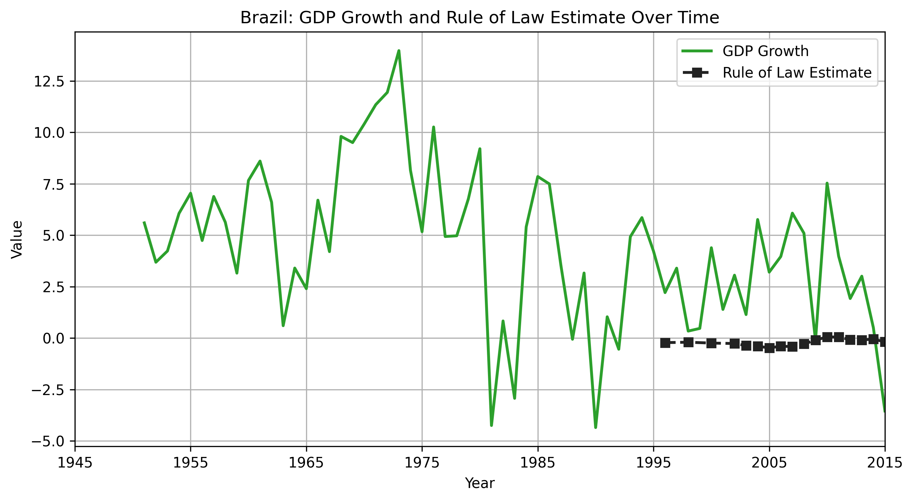
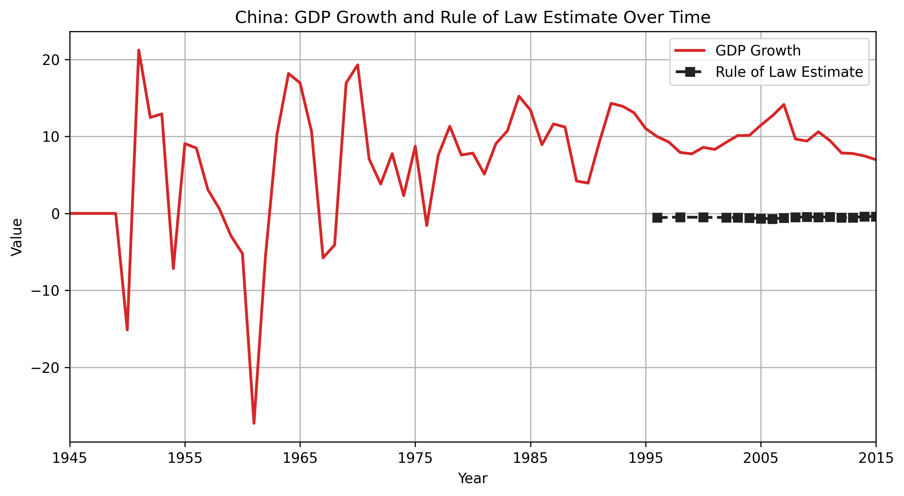
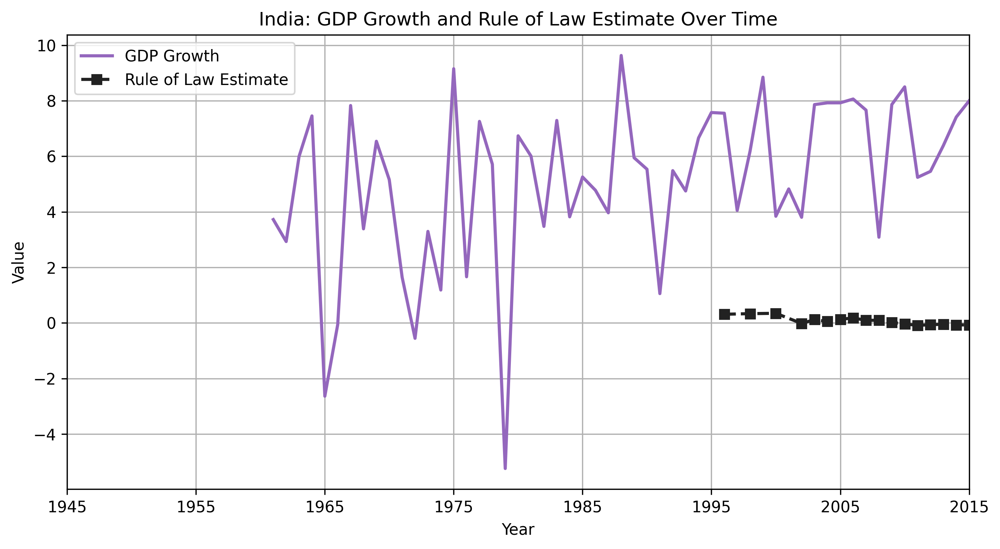
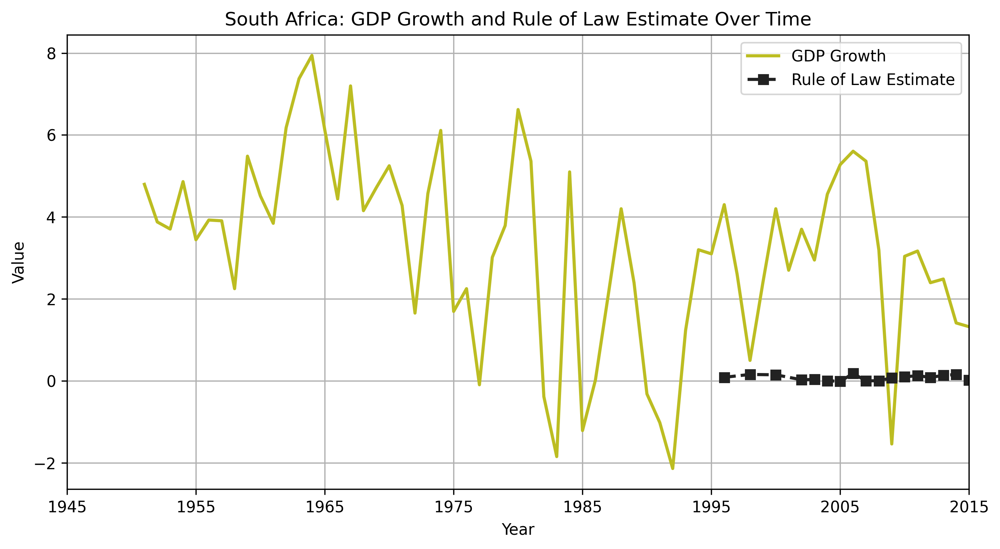

# Regression Output Graph Explanations
---
This document explains the graph outputs generated by `Regression.py`.  
The figures are based on 54 country-year observations for 9 countries from 1990 to 2015.

## GDP Growth vs Rule-of-Law Investment Scatter

This scatter plot shows the raw relationship between the Ford Foundation rule-of-law investment index on the horizontal axis and GDP growth on the vertical axis. Each point is one country-year observation.

The main visual pattern is dispersion rather than a clear linear structure. High investment values do not consistently correspond to high GDP growth, and mid-range investment values can be associated with either low or high growth. The United States sits at the high end of the investment index but remains in a moderate growth range, while countries such as China and India achieve much higher growth at lower index values. The figure therefore suggests that the unconditional relationship between the two variables is weak.

## GDP Growth vs Rule-of-Law Investment Regression Line

This figure adds a fitted linear trend line to the same scatter relationship. The line is almost flat, which indicates that the average linear association between the index-based investment measure and GDP growth is very small.

The wide spread of points around the line matters as much as the slope itself. Even where the fitted line rises slightly, the underlying observations remain highly scattered, so the visual evidence points to a weak aggregate relationship rather than a strong pattern.

## Argentina Trend

Argentina’s graph shows a steadily rising rule-of-law investment index from 2 to 5, while GDP growth moves sharply across the period. Growth is negative in the early years, becomes positive later, and peaks strongly around 2005 to 2010 before easing again by 2015.

The image shows that the index investment series follows a smooth upward path, but GDP growth is cyclical and unstable. The two series do not move together in a simple one-to-one way.

## Brazil Trend

Brazil also shows a steadily increasing investment index, rising from 3 to 6. GDP growth, however, is much more volatile. The series starts with negative growth in 1990, improves during the middle years, strengthens again around 2010, and then falls back into negative territory by 2015.

The figure highlights the contrast between a smooth increase in the index variable and strong macroeconomic fluctuations in growth.

## China Trend

China’s graph combines a rising index investment series with persistently high GDP growth. The index increases from 0 to 6, while GDP growth remains high throughout the period and reaches especially strong levels in the mid-1990s, mid-2000s, and around 2010.

Compared with the other countries, China stands out as the clearest high-growth case. The figure shows that strong growth can coexist with a moderate, gradually rising investment index, but the magnitude of Chinese growth is much larger than the movement in the index itself.

## India Trend

India’s figure shows a steady rise in the investment index from 2 to 5. GDP growth stays relatively high across the whole period, dips around 2000, and then returns to a strong range after 2005.

The image suggests broad long-run improvement in both series, but the timing is not perfectly aligned. GDP growth changes more abruptly than the index investment path.

## Kenya Trend

Kenya shows a gradual increase in the index investment series from 1 to 5. GDP growth is positive at the beginning, weak around 2000, then rebounds strongly by 2005 and 2010 before easing somewhat by 2015.

The figure presents a medium-run improvement story, but again the movement in GDP growth is more uneven than the steady increase in the investment index.

## Mexico Trend

Mexico’s graph is marked by a very large drop in GDP growth in 1995, followed by recovery and continued fluctuation afterward. Over the same period, the investment index rises smoothly from 2 to 5.

The visual contrast is strong: the index variable increases in a stable way, while GDP growth is highly sensitive to short-run shocks. The large 1995 downturn dominates the pattern.

## Nigeria Trend

Nigeria’s figure shows one of the most volatile GDP growth paths in the sample. The investment index rises from 1 to 4, but GDP growth begins very high in 1990, drops close to zero by 1995, then recovers and remains positive before slowing again by 2015.

The graph makes clear that GDP growth fluctuates much more sharply than the investment index. The two series move on very different scales and with very different levels of stability.

## United States Trend

The United States has the highest rule-of-law investment index values in the sample, increasing from 5 to 8. GDP growth remains comparatively stable and stays mostly in the 2% to 4% range.

This figure differs from the high-growth emerging-market cases. It shows high index values combined with moderate, low-volatility growth rather than rapid expansion.

## South Africa Trend

South Africa’s graph shows the index investment series rising from 3 to 7. GDP growth starts low, improves through the middle of the sample, peaks around 2005, and then weakens again by 2015.

The pattern is similar to several other countries in the sample: the investment index rises steadily, but GDP growth follows a more cyclical path with both recovery and slowdown phases.

## Overall Visual Pattern

Across all figures, the rule-of-law investment index tends to increase smoothly over time, while GDP growth varies much more sharply both across countries and across years. The scatter plot and regression-line plot show that the average cross-country relationship is weak, and the country trend plots show that growth dynamics are highly country-specific rather than tightly linked to the index measure alone.

---
## Rule-of-Law Index Construction

The rule-of-law (RoL) variable used in this study is a constructed index based on qualitative evidence from Ford Foundation reports. As the Ford Foundation does not provide standardized quantitative country-year data, this study transforms qualitative descriptions of legal and governance-related activities into a quantitative measure.

The index captures the relative intensity of engagement in rule-of-law-related activities, including legal education, public interest law, access to justice programs, and governance reforms.

Importantly, the index is unitless and should be interpreted as an ordinal index rather than a continuous financial variable. It reflects the intensity of engagement rather than actual funding amounts.

### Construction of Rule-of-Law Index

The index is constructed through a three-step process:

| Step | Description | Operationalization |
|------|------------|-------------------|
| 1. Identification | Extract rule-of-law-related activities from Ford Foundation reports | Legal education, governance reform, public interest law, access to justice |
| 2. Coding | Assign country-year level engagement based on presence and scale | Presence of programs, number of initiatives, continuity over time |
| 3. Index Construction | Convert qualitative information into numerical values | Ordinal scale (0–8) representing intensity of engagement |

### Index Scale Interpretation

| Index Value | Interpretation |
|------------|---------------|
| 0 | No observable rule-of-law engagement |
| 1–2 | Very limited engagement |
| 3–4 | Moderate engagement |
| 5–6 | High engagement |
| 7–8 | Very high and sustained engagement |

The index incorporates historical timing. For example, Ford Foundation rule-of-law engagement in China began in the 1990s. Therefore, values prior to this period are coded as zero or minimal.

## Robustness and Limitations

Several robustness considerations apply to the constructed rule-of-law index:

### 1. Measurement Uncertainty
The index is based on qualitative reports rather than standardized quantitative data. As a result, it may introduce measurement error due to subjective interpretation.

### 2. Ordinal Nature
The index is ordinal rather than continuous. Differences between values (e.g., 2 vs 4) do not represent proportional differences in actual investment.

### 3. Alternative Interpretations
To test robustness, alternative specifications can be considered:
- Binary indicator (presence vs absence of rule-of-law programs)
- Categorical grouping (low, medium, high engagement)
- Lagged index (to account for delayed effects on economic growth)

### 4. Time Consistency
The index accounts for historical timing, but uneven data availability across countries may affect comparability.

### 5. External Validity
The index reflects Ford Foundation engagement specifically and may not capture broader rule-of-law conditions measured by other indices (e.g., World Bank or World Justice Project).
