# World Bank Rule of Law Outputs

This repository now uses the official World Bank Worldwide Governance Indicators (WGI) rule-of-law series `RL.EST` (`Rule of Law: Estimate`) as the rule-of-law variable for all current World Bank-based figures and merged regression outputs.

## Scope

- Main governance variable: `RL.EST`
- Main analysis window: `1996-2025`
- Requested display window for the regional comparison figure: `1990-2025`
- Important data note: official `RL.EST` values begin in `1996`, so `1990-1995` appear as blank years where relevant
- Current data availability note: in the downloaded World Bank files used here, `RL.EST` and GDP indicators are populated through `2024`; `2025` is currently blank.

## Indicator Definitions

### 1. `RL.EST`

| Item | Definition |
|------|------------|
| Code | `RL.EST` |
| Name | Rule of Law: Estimate |
| Source | World Bank, Worldwide Governance Indicators (WGI) |
| Meaning | Perception-based estimate of confidence in and compliance with the rules of society |
| Core dimensions | Contract enforcement, property rights, police, courts, crime and violence |
| Scale | Standardized governance estimate, typically interpreted on an approximate `-2.5` to `+2.5` scale |

Interpretation:

- Higher values indicate stronger perceived rule of law.
- Lower values indicate weaker perceived rule of law.
- `0` is roughly around the middle of the WGI comparison scale.
- The values are not percentages.
- The values are not spending levels, grant amounts, or project-intensity scores.

### 2. `NY.GDP.MKTP.KD.ZG`

| Item | Definition |
|------|------------|
| Code | `NY.GDP.MKTP.KD.ZG` |
| Name | GDP growth (annual %) |
| Source | World Bank |
| Use in this project | Dependent variable in the main scatter and regression outputs |

### 3. `NY.GDP.MKTP.KD`

| Item | Definition |
|------|------------|
| Code | `NY.GDP.MKTP.KD` |
| Name | GDP, constant 2015 US$ |
| Source | World Bank |
| Use in this project | Level control; transformed into `log_gdp` in the regression workflow |

### 4. `SP.DYN.LE00.IN`

| Item | Definition |
|------|------------|
| Code | `SP.DYN.LE00.IN` |
| Name | Life expectancy at birth, total (years) |
| Source | World Bank |
| Use in this project | Additional control variable in the regression workflow |

## Data Files Used

- `CSV_file/WB_index/API_RL.EST_DS2_en_csv_v2_5814.csv`
- `merged_gdp_rule_of_law_dataset.csv`
- `period_averages_gdp_rule_of_law.csv`
- `rl_est_us_china_japan_africa_latam_euro_area_1990_2025.csv`

## Figure Guide

### 1. Combined Rule-of-Law Trend by Country

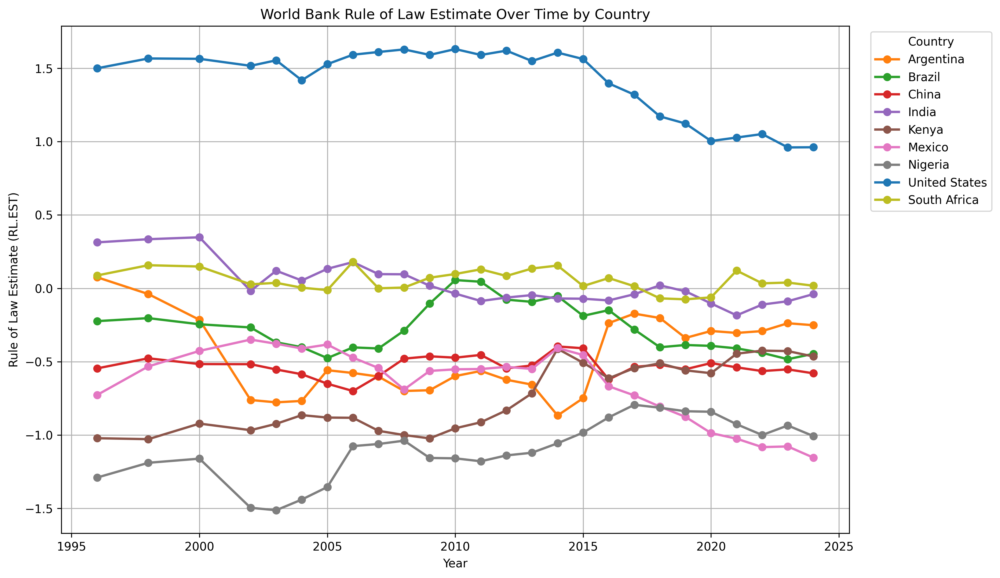

File:
- `rule_of_law_estimate_over_time_by_country.png`

What it shows:

- The official World Bank `RL.EST` series for the project country sample
- Cross-country comparison of long-run rule-of-law trajectories
- The relative position of each country on the WGI rule-of-law scale

How to read it:

- Positive values indicate above-average perceived rule of law.
- Negative values indicate below-average perceived rule of law.
- Year-to-year changes should be interpreted cautiously when they are small.

### 2. Regional Comparison Figure

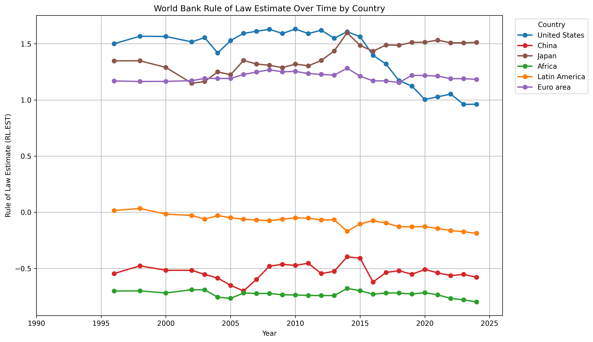

Files:
- `rl_est_us_china_japan_africa_latam_euro_area_1990_2025.png`
- `rl_est_us_china_japan_africa_latam_euro_area_1990_2025.csv`

What it shows:

- `RL.EST` for the United States, China, and Japan
- Regional comparison series for Africa, Latin America, and the Euro area
- A unified view of advanced-economy, large-country, and regional trajectories

Regional construction:

- `Africa` is the simple annual mean of countries tagged as `Sub-Saharan Africa` in the World Bank country metadata.
- `Latin America` is the simple annual mean of countries tagged as `Latin America & Caribbean`.
- `Euro area` is the simple annual mean of 2015 euro-area member states used in the script.

Important note:

- Although the chart spans `1990-2025`, all six series begin in `1996` because `RL.EST` is not available before 1996. The current downloaded `RL.EST` series is populated through `2024`.

### 3. GDP Growth vs Rule of Law Scatter

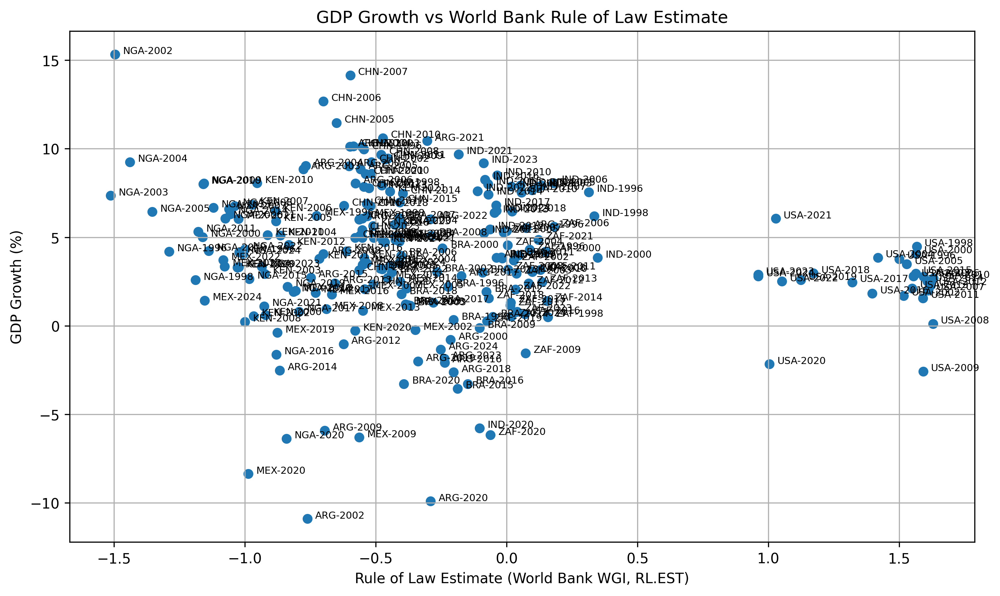

File:
- `gdp_vs_rule_of_law_scatter.png`

What it shows:

- Country-year observations with `RL.EST` on the horizontal axis
- GDP growth on the vertical axis
- The raw cross-sectional relationship in the selected sample

Reading:

- This figure is descriptive, not causal.
- The sample does not show a strong positive unconditional relationship between higher `RL.EST` and higher contemporaneous GDP growth.

### 4. GDP Growth vs Rule of Law Regression Line

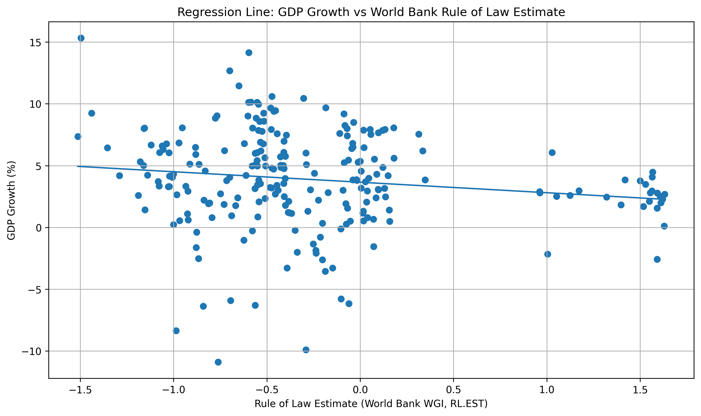

File:
- `gdp_vs_rule_of_law_regression_line.png`

What it shows:

- The fitted linear relationship between GDP growth and `RL.EST`
- A visual summary of the simple OLS pattern in the sample

Reading:

- The fitted slope is negative in the current sample.
- This should be read as a sample pattern, not as proof that stronger rule of law reduces growth.

### 5. Country Trend Panels

Each country panel combines GDP growth and the World Bank rule-of-law estimate over time.

#### Argentina

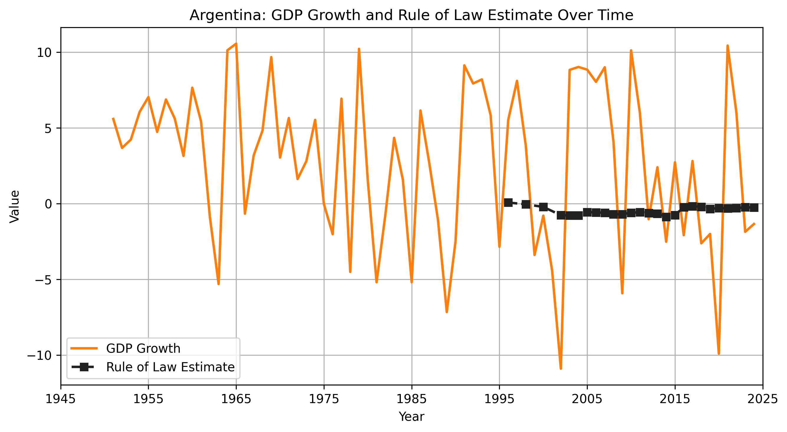

File:
- `ARG_trend.png`

Reading:

- Argentina trends from slightly positive rule-of-law values in the late 1990s to clearly negative values in the latest available observations.

#### Brazil

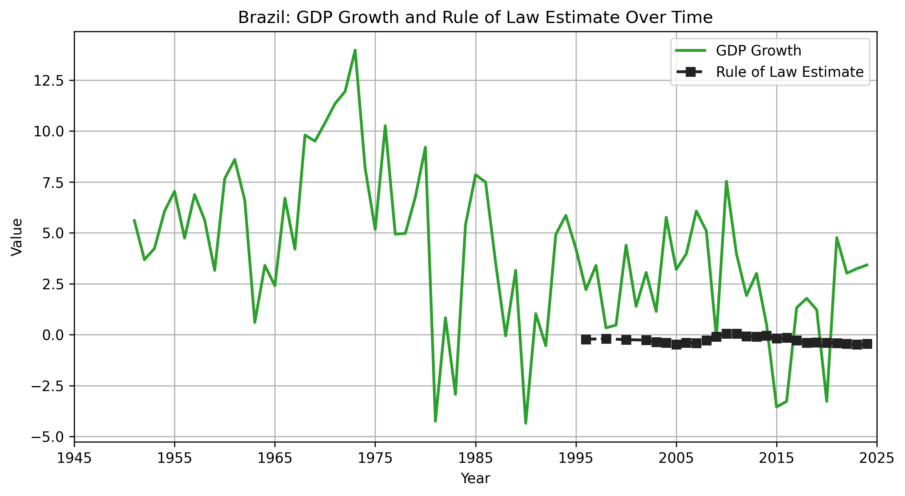

File:
- `BRA_trend.png`

Reading:

- Brazil stays close to the midpoint of the WGI scale and fluctuates over time.

#### China

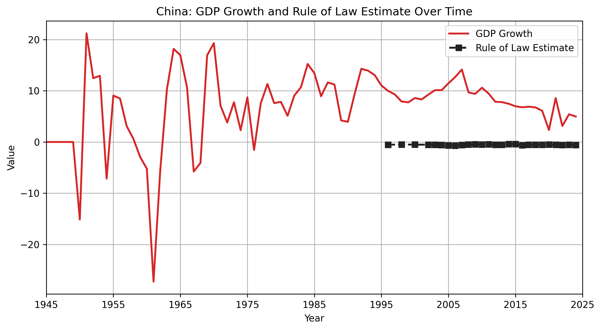

File:
- `CHN_trend.png`

Reading:

- China remains below zero throughout the sample but improves modestly relative to its starting point.

#### India

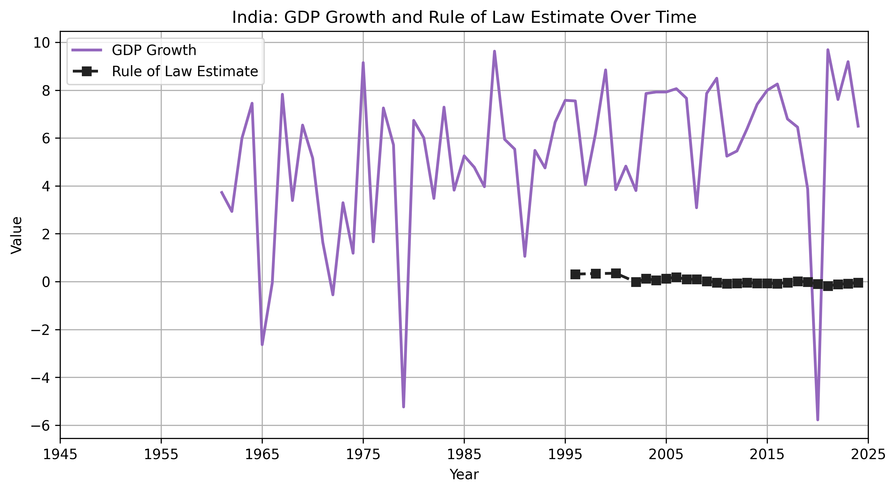

File:
- `IND_trend.png`

Reading:

- India starts positive and trends downward toward the midpoint by the 2010s.

#### Kenya

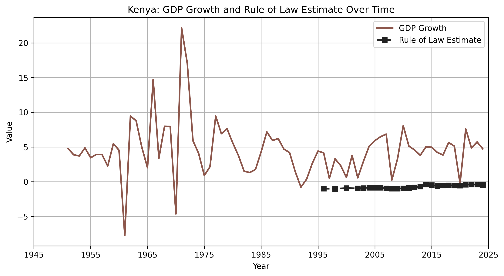

File:
- `KEN_trend.png`

Reading:

- Kenya remains below average on `RL.EST` but improves materially over the period.

#### Mexico

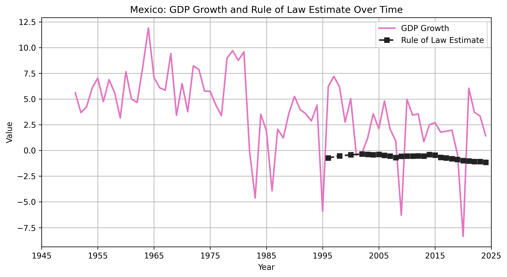

File:
- `MEX_trend.png`

Reading:

- Mexico remains negative throughout the sample with moderate long-run improvement.

#### Nigeria

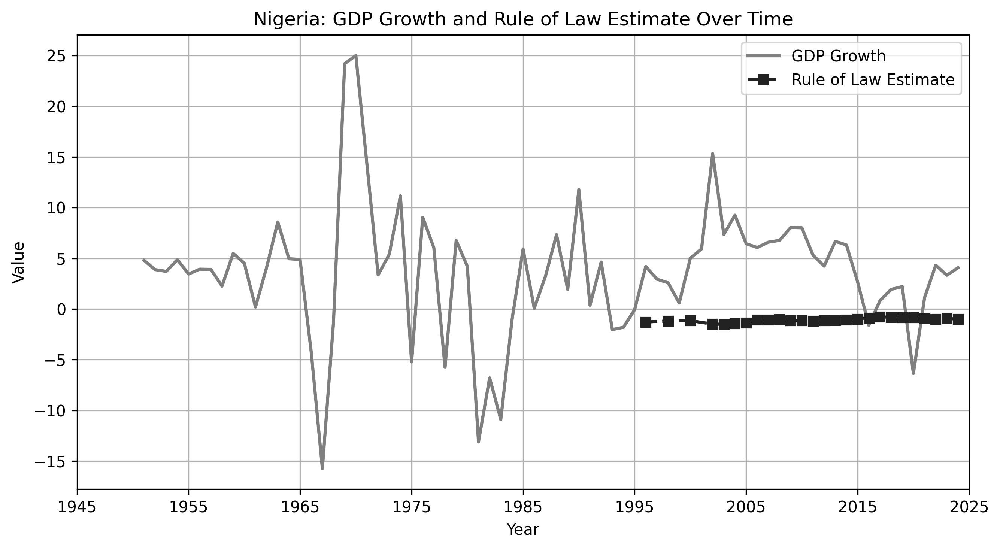

File:
- `NGA_trend.png`

Reading:

- Nigeria is persistently weak on `RL.EST`, though it improves somewhat by the latest available observations.

#### United States

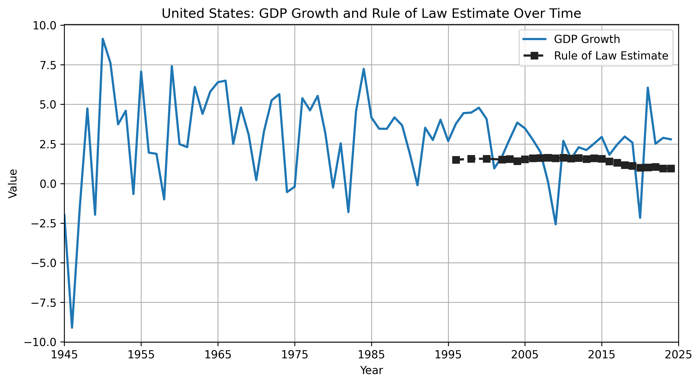

File:
- `USA_trend.png`

Reading:

- The United States remains consistently high and positive across the sample.

#### South Africa

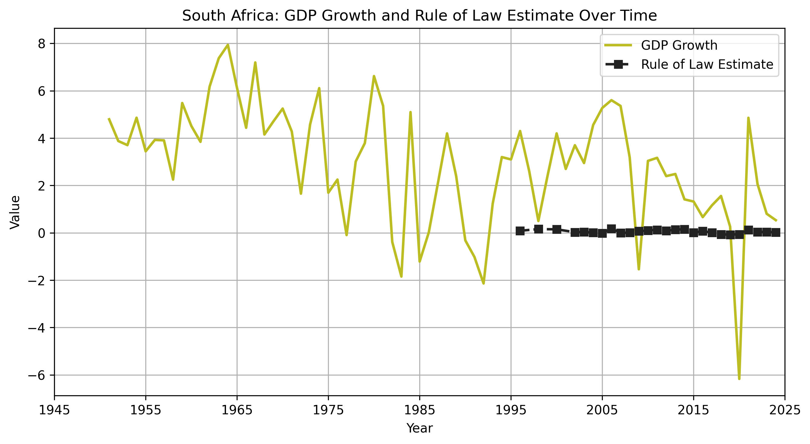

File:
- `ZAF_trend.png`

Reading:

- South Africa stays close to the midpoint, with fluctuation rather than a strong directional trend.

## Regression Summary

The current World Bank-based regression outputs report the following headline results:

| Model | Coefficient on `RL.EST` | p-value | R-squared | Interpretation |
|------|--------------------------|---------|-----------|----------------|
| Simple OLS | -0.848 | 0.0015 | 0.024 | Negative cross-country association, low explanatory power |
| OLS with controls (`log_gdp`, `life_expectancy`) | -1.577 | <0.0001 | 0.108 | Negative association remains after controls |
| Country fixed effects | -1.560 | 0.2631 | 0.320 | Within-country effect is not statistically significant |
| Period regression `1996-2005` | -0.919 | 0.0648 | 0.037 | Negative, marginal significance |
| Period regression `2006-2025` | -0.812 | 0.0070 | 0.020 | Negative association in the later period, with lower explanatory power |

Main takeaway:

- The negative sign is driven mainly by cross-country differences in the selected sample.
- Once country fixed effects are included, the rule-of-law coefficient is not statistically significant.

## Interpretation Rules

- Describe the rule-of-law variable as the official World Bank WGI `RL.EST` series.
- Do not describe `RL.EST` as a funding index.
- Do not describe `RL.EST` as a Ford Foundation program score.
- Do not interpret the values as percentages.
- Do interpret `RL.EST` as a perception-based latent governance estimate.

## Current Canonical World Bank Figure Set

The repository root now serves as the canonical location for the current World Bank output figures:

- `rule_of_law_estimate_over_time_by_country.png`
- `rl_est_us_china_japan_africa_latam_euro_area_1990_2025.png`
- `gdp_vs_rule_of_law_scatter.png`
- `gdp_vs_rule_of_law_regression_line.png`
- `ARG_trend.png`
- `BRA_trend.png`
- `CHN_trend.png`
- `IND_trend.png`
- `KEN_trend.png`
- `MEX_trend.png`
- `NGA_trend.png`
- `USA_trend.png`
- `ZAF_trend.png`

Duplicate copies inside `CSV_file/` and obsolete rule-of-law image variants are not part of the canonical set.

## Color Reference

The following table summarizes the color codes currently used for countries and regional series across the World Bank rule-of-law figures in this repository.

| Series | Code | Hex Color | Used In |
|------|------|-----------|---------|
| United States | `USA` | `#1f77b4` | Country trend figures, combined country figure, regional comparison figure |
| China | `CHN` | `#d62728` | Country trend figures, combined country figure, regional comparison figure |
| India | `IND` | `#9467bd` | Country trend figures, combined country figure |
| Brazil | `BRA` | `#2ca02c` | Country trend figures, combined country figure |
| Mexico | `MEX` | `#e377c2` | Country trend figures, combined country figure |
| Kenya | `KEN` | `#8c564b` | Country trend figures, combined country figure |
| Nigeria | `NGA` | `#7f7f7f` | Country trend figures, combined country figure |
| South Africa | `ZAF` | `#bcbd22` | Country trend figures, combined country figure |
| Argentina | `ARG` | `#ff7f0e` | Country trend figures, combined country figure |
| Japan | `JPN` | `#2ca02c` | Regional comparison figure |
| Africa | `Sub-Saharan Africa` | `#8c564b` | Regional comparison figure |
| Latin America | `Latin America & Caribbean` | `#ff7f0e` | Regional comparison figure |
| Euro area | `Euro area` | `#9467bd` | Regional comparison figure |
